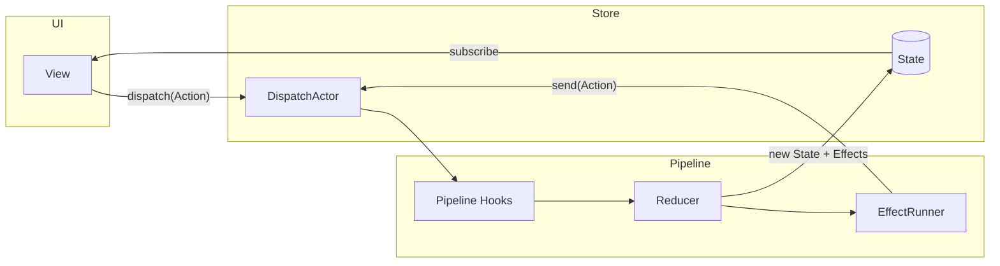
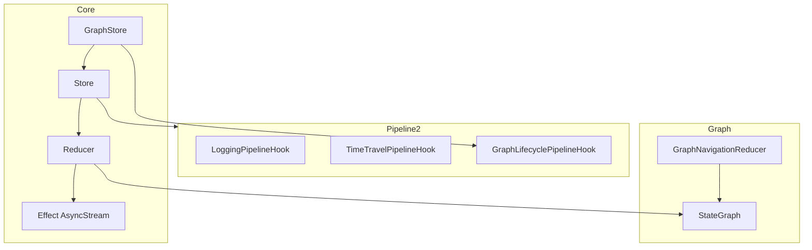

# Swift-Rex


[](https://swift.org)
[](https://developer.apple.com/ios/)
[](LICENSE)
[](https://swift.org/package-manager)

Swift-Rex is a modern state management library for SwiftUI and UIKit. Inspired by TCA and Redux, it provides a unidirectional data flow with **AsyncStream effects**, **Pipeline Hooks 2.0**, and **State Graph** navigation.

## 🚀 Key Features

- 🎯 **Store · Reducer · Action** — Simple, predictable state management
- 🔄 **AsyncStream Effects** — One-shot and long-lived side effects (timers, WebSocket, Combine)
- 🪝 **Pipeline Hooks 2.0** — Phase-based observability (logging, analytics, time travel)
- 🗺 **State Graph** — Tree-shaped navigation with mount/unmount lifecycle and scoped effect cancellation
- 🧩 **Composable Reducers** — `ScopeReducer`, `CombineReducer`, `GraphNavigationReducer`
- 📐 **Derived State** — Memoized computed values from base state
- 📱 **Cross-Platform** — SwiftUI (`ObservableStore`) and UIKit (`Store.subscribe`)
- 🛡️ **Thread-Safe** — Actor-based dispatch queue with guaranteed action ordering
- 🧪 **RexTesting** — `TestStore` harness for reducer and effect testing

## 🏗 Architecture

Swift-Rex uses unidirectional data flow:

**UI → Action → Pipeline Hooks → Reducer → (State + Effects) → UI**





**Pipeline phases** (each action):

| Phase | Description |
|-------|-------------|
| `willReceive` | Action entered the store |
| `willReduce` | About to run the reducer |
| `didReduce` | State before/after snapshot |
| `willRunEffects` | Effects about to start |
| `didRunEffects` | Effects finished |
| `didComplete` | Full cycle complete |

## 📦 Installation

### Swift Package Manager

```swift
dependencies: [
    .package(url: "https://github.com/pelagornis/swift-rex.git", from: "1.0.0")
]
```

For testing:

```swift
.testTarget(
    name: "MyAppTests",
    dependencies: ["MyApp", "RexTesting"]
)
```

## 📖 Documentation

- [`main`](https://pelagornis.github.io/swift-rex/main/documentation/rex/)

## 🎯 Basic Usage

### 1. Define State

```swift
import Rex

struct AppState: Statable {
    var count: Int = 0
    var isLoading: Bool = false
    var errorMessage: String? = nil
    var lastUpdated: Date = Date()
}
```

### 2. Define Actions

```swift
enum AppAction: Actionable {
    case increment
    case decrement
    case loadFromServer
    case loadedFromServer(Int)
    case setError(String?)
}
```

### 3. Define Reducer

```swift
struct AppReducer: Reducer {
    func reduce(state: inout AppState, action: AppAction) -> [Effect<AppAction>] {
        switch action {
        case .increment:
            state.count += 1
            state.lastUpdated = Date()
            return []

        case .loadFromServer:
            state.isLoading = true
            state.errorMessage = nil
            return [
                Effect { emitter in
                    try? await Task.sleep(nanoseconds: 1_000_000_000)
                    emitter.send(.loadedFromServer(500))
                }
            ]

        case .loadedFromServer(let value):
            state.count = value
            state.isLoading = false
            state.lastUpdated = Date()
            return []

        case .decrement:
            state.count -= 1
            state.lastUpdated = Date()
            return []

        case .setError(let message):
            state.errorMessage = message
            state.isLoading = false
            return []
        }
    }
}
```

### 4. Create Store

```swift
let store = Store(
    initialState: AppState(),
    reducer: AppReducer(),
    pipelineHooks: {
        [
            AnyPipelineHook(LoggingPipelineHook(label: "App"))
        ]
    }
)
```

### 5. Thread Safety

All state updates flow through a `DispatchActor` — actions are processed **one at a time**, even when dispatched concurrently. Subscribers receive updates on the thread that completed the reducer.

## 🪝 Pipeline Hooks

Pipeline Hooks replace the legacy middleware pattern with explicit phases. Use them for logging, analytics, debugging, and time travel.

```swift
let store = Store(
    initialState: AppState(),
    reducer: AppReducer(),
    pipelineHooks: {
        [
            AnyPipelineHook(LoggingPipelineHook(label: "MyApp")),
            AnyPipelineHook(AnalyticsPipelineHook())
        ]
    },
    timeTravel: TimeTravelPipelineHook()  // enables undo/redo
)

// After dispatch:
await store.undoTimeTravel()
await store.redoTimeTravel()
```

Custom hook:

```swift
struct AnalyticsPipelineHook<State: Statable, Action: Actionable>: PipelineHook {
    func handle(
        phase: PipelinePhase<Action, State>,
        context: PipelineContext<Action, State>
    ) async -> HookResult<Action> {
        if case .didReduce(let action, _, _) = phase {
            Analytics.track(action: "\(action)")
        }
        return .continue
    }
}
```

> **Legacy Middleware:** Existing `Middleware` types still work via `middlewares:` — they are adapted to run at the `willReceive` phase. New code should prefer `pipelineHooks:`.

## 🔄 Effects

Effects are modeled as `AsyncStream<Action>` — suitable for one-shot tasks and long-lived streams.

```swift
// One-shot async work
Effect { emitter in
    let data = try await URLSession.shared.data(from: url)
    emitter.send(.dataLoaded(data))
}

// Cancellable effect (replaces in-flight runs with same id)
Effect(id: EffectID("search"), cancelInFlight: true) { emitter in
    let results = try await searchAPI(query)
    emitter.send(.searchResults(results))
}

// Long-lived stream (timer, WebSocket, Combine)
Effect.stream {
    AsyncStream { continuation in
        let task = Task {
            for await _ in Timer.publish(every: 1, on: .main, in: .common).autoconnect() {
                continuation.yield(.timerTick)
            }
        }
        continuation.onTermination = { _ in task.cancel() }
    }
}

// Built-in helpers
Effect.just(.increment)
Effect.many(.action1, .action2)
Effect.delayed(.action, delay: 1.0)
Effect.none
```

Cancel effects manually:

```swift
store.cancelEffect(id: EffectID("search"))
```

## 🗺 State Graph

Model navigation as a tree of mounted nodes. Feature state stays in your app state; the graph tracks topology and lifecycle.

```swift
struct AppState: Statable, GraphStateContainer {
    var graph: StateGraph = StateGraph()
    var messages: [Message] = []
    // ...
}

enum AppAction: Actionable {
    case graph(GraphAction)
    case sendMessage(String)
    // ...
}

struct AppReducer: Reducer {
    private let navigation = GraphNavigationReducer<AppState>()

    func reduce(state: inout AppState, action: AppAction) -> [Effect<AppAction>] {
        switch action {
        case .graph(let graphAction):
            _ = navigation.reduce(state: &state, action: graphAction)
            return []
        // ...
        }
    }
}
```

Use `GraphStore` for navigation helpers and automatic lifecycle management (unmounting cancels scoped effects):

```swift
let graphStore = GraphStore(
    initialState: AppState(),
    reducer: AppReducer(),
    embedGraphAction: { .graph($0) },
    pipelineHooks: {
        [AnyPipelineHook(LoggingPipelineHook(label: "ChatApp"))]
    }
)

graphStore.push("second")   // activePath: root → second
graphStore.pop()            // back to root, cancels second's effects
graphStore.popToRoot()
```

Read navigation state in views:

```swift
Text("Graph: \(store.state.graph.activePath.map(\.rawValue).joined(separator: " → "))")

if store.state.graph.activeNodeID?.rawValue == "second" {
    SecondView()
}
```

Child screens communicate with the parent via delegate actions instead of a global event bus:

```swift
enum DelegateAction: Actionable {
    case messageToChat(String)
    case dismiss
}

// SecondView
store.send(.delegate(.messageToChat("Hello from second page!")))
```

## 📐 Derived State

Compute memoized values from base state:

```swift
var unreadCount = DerivedState<AppState, Int> { state in
    state.messages.filter { !$0.isRead }.count
}

// In reducer or view
let count = unreadCount.value(from: state)
```

For one-off computation in views:

```swift
let onlineCount = derive(from: store.state) { $0.onlineUsers.count }
```

## 📱 SwiftUI Integration

### ObservableStore

```swift
import SwiftUI
import Rex

struct ContentView: View {
    @ObservedObject var store: ObservableStore<AppReducer>

    var body: some View {
        VStack {
            Text("Count: \(store.state.count)")
            Button("+1") { store.send(.increment) }
        }
    }
}
```

### AppEnvironment pattern (GraphStore + SwiftUI)

When using `GraphStore`, wrap both the graph store and `ObservableStore` in an `ObservableObject` and forward `objectWillChange`:

```swift
@MainActor
final class AppEnvironment: ObservableObject {
    let graphStore: GraphStore<AppReducer>
    let observableStore: ObservableStore<AppReducer>
    private var subscription: AnyCancellable?

    init() {
        let graphStore = GraphStore(
            initialState: AppState(),
            reducer: AppReducer(),
            embedGraphAction: { .graph($0) },
            pipelineHooks: { [AnyPipelineHook(LoggingPipelineHook(label: "App"))] }
        )
        self.graphStore = graphStore
        self.observableStore = ObservableStore(store: graphStore.store)

        subscription = observableStore.objectWillChange
            .receive(on: DispatchQueue.main)
            .sink { [weak self] _ in self?.objectWillChange.send() }
    }
}

struct ContentView: View {
    @StateObject private var environment = AppEnvironment()

    var body: some View {
        Text("Online: \(environment.observableStore.state.onlineUsers.count)")
    }
}
```

Two-way bindings:

```swift
TextField("Name", text: store.binding(\.name, send: AppAction.setName))
```

## 🎨 UIKit Integration

Subscribe to state changes and update UI on the main actor:

```swift
class ViewController: UIViewController {
    private let store: Store<AppReducer>

    init() {
        self.store = Store(
            initialState: AppState(),
            reducer: AppReducer(),
            pipelineHooks: { [AnyPipelineHook(LoggingPipelineHook())] }
        )
        super.init(nibName: nil, bundle: nil)

        store.subscribe { [weak self] _ in
            Task { @MainActor in self?.updateUI() }
        }
    }

    private func updateUI() {
        Task {
            let state = await store.state
            await MainActor.run {
                label.text = "Count: \(state.count)"
            }
        }
    }

    @objc private func increment() { store.dispatch(.increment) }
}
```

## 🧪 Testing

Use the `RexTesting` module for reducer tests:

```swift
import Rex
import RexTesting
import XCTest

final class AppReducerTests: XCTestCase {
    func testIncrement() async {
        let testStore = TestStore(
            initialState: AppState(count: 0),
            reducer: AppReducer()
        )

        await testStore.send(.increment)
        XCTAssertEqual(testStore.state.count, 1)
    }
}
```

## 📡 Event Bus (Optional)

Each `Store` has an optional `EventBus` for cross-component messaging. The example apps prefer **delegate actions** and **State Graph** for parent-child communication; use EventBus when you need decoupled pub/sub outside the reducer tree.

```swift
store.getEventBus().publish(MyEvent(id: "123"))
store.getEventBus().subscribe(to: MyEvent.self) { event in
    print(event)
}
```

## 📋 Example Apps

| App | Description |
|-----|-------------|
| **ExampleSwiftUI** | Chat app with `GraphStore`, pipeline logging, delegate actions between pages, and graph-based navigation |
| **ExampleUIKit** | Game app with the same GraphStore pattern and manual UI updates via `store.subscribe` |

Run the examples in Xcode to see the full pipeline log output:

```
[ChatApp] willReceive: triggerUserJoin
[ChatApp] willReduce: triggerUserJoin
[ChatApp] didReduce: triggerUserJoin
[ChatApp] willRunEffects: triggerUserJoin (1 effects)
[ChatApp] didComplete: triggerUserJoin
```

## License

**swift-rex** is under MIT license. See the [LICENSE](LICENSE) file for more info.
